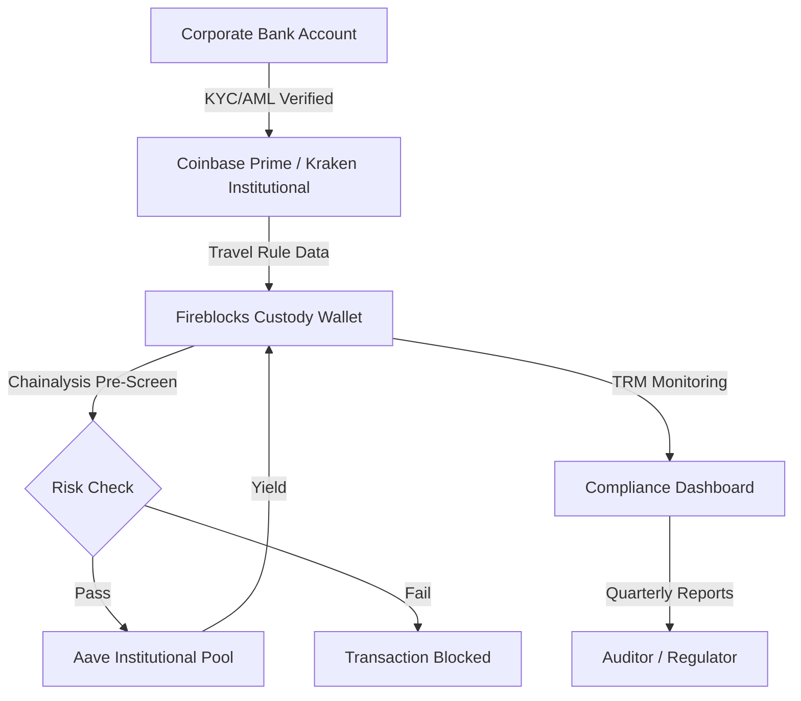

## Executive Summary

South Korea's Financial Intelligence Unit (KoFIU) issued a **six-month business suspension** to Bithumb, one of the country's largest cryptocurrency exchanges, for systemic AML failures. The enforcement action highlights critical compliance gaps that extend beyond centralized exchanges into DeFi protocols—particularly as institutional participation scales.

**Key implications:**
- AML deficiencies in customer due diligence (CDD) and suspicious transaction reporting
- Travel Rule implementation failures for cross-border transactions
- Rising global scrutiny on DeFi protocol AML obligations
- Institutional risk mitigation strategies for compliant DeFi participation

## The Bithumb Case: What Happened

### Enforcement Action Details

**Violations Identified:**
1. **Inadequate Customer Due Diligence (CDD)**
   - Failed to verify beneficial ownership for corporate accounts
   - Insufficient Enhanced Due Diligence (EDD) for high-risk jurisdictions
   - Weak ongoing monitoring of customer activity

2. **Suspicious Transaction Reporting Failures**
   - Delayed or missing STRs for transactions exceeding thresholds
   - Inadequate investigation of red flags (layering, structuring)
   - Insufficient analyst training and case management tools

3. **Travel Rule Non-Compliance**
   - Failed to collect/transmit originator/beneficiary information for transfers ≥10M KRW (~$7,500)
   - No interoperability with global Travel Rule solutions (TRISA, Sygna Bridge)

**Regulatory Context:**
- South Korea's Act on Reporting and Using Specified Financial Transaction Information
- Alignment with FATF Recommendation 16 (Travel Rule)
- Precedent: Upbit fined in 2023 for similar violations

### Systemic Impact

**Market Effects:**
- Bithumb trading volume dropped 40% following announcement
- Customer exodus to compliant competitors (Upbit, Coinone)
- KRW trading pairs frozen during suspension period

**Broader Signal:**
- Global regulators coordinating enforcement
- No safe harbor for non-compliant entities, regardless of size
- AML infrastructure = competitive differentiator

## DeFi AML Landscape: Regulatory Expectations

### FATF Guidance on Virtual Assets

The Financial Action Task Force (FATF) updated guidance in 2021-2023 establishing that:

**DeFi Protocols May Constitute VASPs**
- If a protocol's creators/operators maintain control or ongoing involvement
- Governance token holders with executive authority may be "VASPs by association"
- Smart contract upgradeability ≠ automatic exemption

**Travel Rule Obligations**
- Apply to transactions ≥$1,000 USD (or equivalent)
- Originator VASP must collect: name, account number, address/ID, beneficiary VASP name
- Beneficiary VASP must verify and retain information

**Risk-Based Approach**
- Higher scrutiny for: mixing services, privacy coins, unhosted wallets
- Ongoing monitoring and suspicious activity detection required

### Jurisdictional Implementations

**European Union (MiCA + TFR)**
- Markets in Crypto-Assets Regulation operational 2024
- Transfer of Funds Regulation extends Travel Rule to all crypto transfers
- Unhosted wallet transfers >€1,000 require self-declaration

**United States**
- FinCEN: VASPs subject to BSA/AML requirements since 2013
- SEC: DeFi protocols with "control" may be exchanges (Uniswap Wells Notice)
- OFAC: Sanctions compliance required (Tornado Cash enforcement)

**United Kingdom**
- FCA: Cryptoasset registration regime with AML supervision
- Travel Rule enforcement via FCA's CASS rules
- Ongoing consultation on DeFi-specific guidance

**Hong Kong**
- VASP licensing mandatory for centralized and custodial services
- Travel Rule threshold: HK$8,000 (~$1,000 USD)
- Sandbox for compliant DeFi innovation

## Institutional DeFi AML Architecture

### Compliance Stack Components

**1. On-Chain Identity & KYC**

DeFi protocols serving institutions must implement permissioning layers:

```solidity
// Example: KYC-gated liquidity pool
interface IKYCRegistry {
    function isVerified(address user) external view returns (bool);
    function getJurisdiction(address user) external view returns (string memory);
    function getRiskScore(address user) external view returns (uint8);
}

contract InstitutionalPool {
    IKYCRegistry public kycRegistry;
    
    modifier onlyVerified() {
        require(kycRegistry.isVerified(msg.sender), "KYC required");
        _;
    }
    
    function deposit(uint256 amount) external onlyVerified {
        // AML-compliant deposit logic
    }
}
```

**Standards:**
- **ERC-735**: Claim-based identity (verifiable credentials)
- **ERC-1400**: Security token standard with transfer restrictions
- **DID (Decentralized Identifiers)**: W3C standard for on-chain identity

**2. Transaction Monitoring & Screening**

**Off-Chain Integration (Pre-Transaction):**
- Chainalysis Kyt (Know Your Transaction)
- Elliptic Navigator
- TRM Labs Risk API

**On-Chain Enforcement (Smart Contract Level):**
- OFAC sanctions list oracle (Chainlink, Compound governance)
- Real-time risk scoring based on address activity
- Circuit breakers for high-risk counterparties

**Post-Transaction Analysis:**
- Heuristic clustering (linking addresses to entities)
- Behavioral anomaly detection
- Cross-chain tracing (bridge, DEX aggregator flows)

**3. Travel Rule Infrastructure**

**Centralized Exchange Solutions:**
- **TRISA (Travel Rule Information Sharing Architecture)**: Open-source global network
- **Sygna Bridge**: Crypto-native Travel Rule compliance protocol
- **Notabene**: SaaS platform for Travel Rule data exchange

**DeFi Adaptation Challenges:**
- No direct counterparty in AMM swaps (Uniswap, Curve)
- Composability: single transaction touches multiple protocols
- Unhosted wallets: self-custody users lack VASP infrastructure

**Hybrid Solutions:**
- **Permissioned Pools**: Institutional-only liquidity with Travel Rule data exchange
- **Bridge KYC**: Identity verification at fiat on/off-ramps (Wyre, MoonPay)
- **Proxy Services**: Compliant intermediaries for DeFi access (Copper, Fireblocks)

## Case Study: Institutional Treasury DeFi Strategy

### Scenario: $200M Corporate Treasury

**Objectives:**
- Yield generation on stablecoin reserves
- DeFi participation without AML/sanctions risk
- Audit trail for regulatory examination

### Compliant Architecture



**Implementation Steps:**

**Phase 1: Infrastructure (Weeks 1-4)**
1. Select regulated custodian with Travel Rule integration (Fireblocks, Anchorage, Copper)
2. Deploy Chainalysis Kyt / TRM Labs risk API
3. Establish on-chain identity via compliant DID provider (Civic, Fractal)

**Phase 2: Protocol Selection (Weeks 5-8)**
4. Evaluate DeFi protocols with institutional-grade AML:
   - **Aave Arc**: Permissioned pool for institutions
   - **Compound Treasury**: KYC-gated lending markets
   - **Maple Finance**: Uncollateralized lending with KYC/accreditation
5. Negotiate SLAs and compliance reporting with protocol operators

**Phase 3: Pilot Deployment (Months 3-6)**
6. Small allocation (1-5% treasury) to test end-to-end compliance
7. Document procedures: transaction pre-screening, monitoring, STR triggers
8. Train treasury staff on AML red flags and escalation

**Phase 4: Production (Month 7+)**
9. Scale allocation based on risk tolerance and audit outcomes
10. Quarterly compliance reviews with external auditor
11. Engage with regulators proactively (no-action letter requests)

## Risk Assessment Framework

### AML Risk Matrix for DeFi Protocols

| **Protocol Type**         | **AML Risk** | **Mitigation Strategies**                                                                 |
|---------------------------|--------------|------------------------------------------------------------------------------------------|
| **Permissioned DeFi**     | Low          | Built-in KYC/AML; ideal for institutions                                                 |
| **Public Lending**        | Medium       | Pre-transaction screening; whitelisted counterparties only                               |
| **DEX (AMM)**             | High         | Avoid or use via compliant aggregator with Travel Rule bridge                            |
| **Bridges**               | High         | Cross-chain tracing tools; limit to audited, transparent bridges                         |
| **Privacy Protocols**     | Critical     | Avoid entirely unless regulatory exemption (e.g., whistleblower protection use case)    |

### Red Flags & STR Triggers

**On-Chain Indicators:**
- Funds originating from known mixer (Tornado Cash, etc.)
- Rapid movement through multiple wallets (layering)
- High-frequency deposits just below reporting thresholds (structuring)
- Transactions with OFAC-sanctioned addresses
- Unusual gas price patterns (obfuscation attempts)

**Behavioral Indicators:**
- Customer requests to bypass KYC procedures
- Inconsistent wallet usage patterns vs. stated business purpose
- Attempts to exploit protocol vulnerabilities for fund movement
- Unusual jurisdiction changes (VPN/proxy indicators)

## Enforcement Trends & Forward Outlook

### Recent Actions

**2024-2026 Global Enforcement:**
- **Binance**: $4.3B settlement with DOJ/CFTC for BSA/AML violations
- **Kraken**: $360K fine from FinCEN for Travel Rule gaps
- **Uniswap Labs**: Ongoing SEC investigation re: unregistered exchange
- **Tornado Cash**: OFAC sanctions upheld (6th Circuit 2025)

**Trend Analysis:**
- Enforcement shifting from retail fraud → institutional AML gaps
- Regulators targeting "control persons" behind DeFi protocols
- No distinction between CEX and "decentralized" for AML purposes

### 2026-2027 Priorities

**Regulatory Focus Areas:**
1. **Cross-Border Coordination**: FATF mutual evaluations emphasizing crypto
2. **DeFi Rulemaking**: SEC/CFTC joint guidance expected Q2 2026
3. **Stablecoin AML**: CLARITY Act implementation will impose bank-like AML on issuers
4. **AI-Powered Monitoring**: Regulators adopting ML for anomaly detection

**Industry Response:**
- **Self-Regulatory Organizations (SROs)**: Crypto industry consortiums (DACOM, CryptoUK)
- **AML Protocol Standards**: ERC proposals for on-chain compliance primitives
- **Insurance Products**: Coverage for AML-related enforcement (Lloyd's syndicates entering market)

## Institutional Best Practices

### Governance & Oversight

**Board-Level Responsibilities:**
- Designate Chief Compliance Officer with crypto expertise
- Quarterly AML risk assessments presented to audit committee
- Annual independent compliance audit by Big 4 or specialized firm

**AML Program Components:**
1. **Written Policies & Procedures**: Customized for crypto operations
2. **Risk Assessment**: Updated semi-annually based on protocol exposures
3. **Internal Controls**: Segregation of duties, dual authorization for high-risk txns
4. **Testing & Audit**: Penetration testing of screening tools; annual SOC 2 Type II
5. **Training**: Quarterly sessions for treasury, legal, IT staff

### Technology Stack

**Minimum Viable AML Infrastructure:**
- **Custody**: Institutional-grade with Travel Rule integration (Fireblocks, Anchorage, Copper)
- **Screening**: Real-time address risk scoring (Chainalysis, Elliptic, TRM)
- **Monitoring**: Transaction pattern analysis, alert management (NICE Actimize, ComplyAdvantage)
- **Reporting**: Automated STR generation, regulatory filing integration
- **Identity**: Decentralized identity with verifiable credentials (Civic, Fractal, Polygon ID)

**Integration Architecture:**
- API-based for real-time pre-transaction screening
- Webhook alerts for post-transaction anomaly detection
- Data warehouse for compliance analytics and audit trail

## Conclusion

The Bithumb enforcement is a watershed moment: **AML compliance is no longer optional** for any entity facilitating crypto transactions, centralized or decentralized. For institutions entering DeFi:

1. **Assume VASP obligations** unless regulatory exemption is explicit
2. **Build compliance infrastructure first**, optimize yields second
3. **Partner with regulated intermediaries** for Travel Rule and screening
4. **Document everything**: procedures, decisions, risk assessments
5. **Engage regulators proactively**: no-action letters, sandbox participation

The institutions that navigate AML complexity successfully will dominate the institutional DeFi market. Those that treat it as an afterthought face Bithumb's fate—or worse.

---

## Need Help with DeFi AML Compliance?

The DIAN Framework includes comprehensive AML/sanctions screening guidance and institutional compliance architecture.

**[Schedule Consultation →](/consulting)**

**[View DIAN Framework →](/framework)**

---

## Additional Resources

- [FATF Guidance on Virtual Assets (2023 Update)](https://www.fatf-gafi.org)
- [FinCEN: Application of BSA to Cryptocurrency](https://www.fincen.gov)
- [Chainalysis: DeFi Compliance Guide](https://www.chainalysis.com)
- [TRISA: Travel Rule Implementation](https://trisa.io)
- [TRM Labs: Sanctions & AML Screening](https://www.trmlabs.com)
