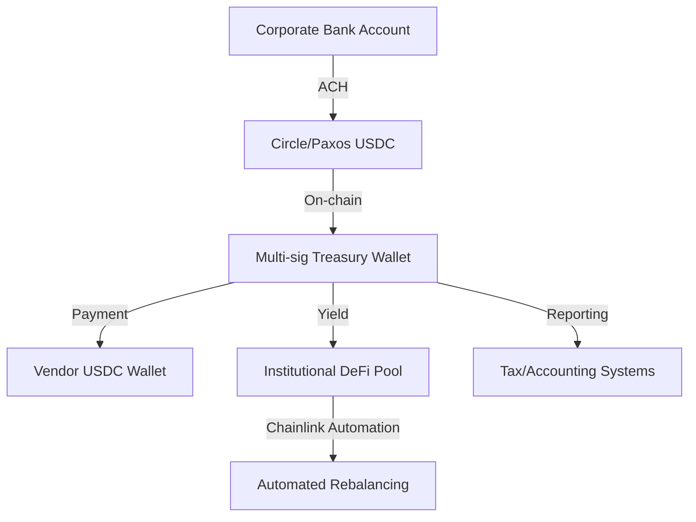

## Executive Summary

The Clarity for Payment Stablecoins Act of 2025 (CLARITY Act) represents a watershed moment for institutional cryptocurrency adoption in the United States. As part of broader crypto market structure legislation, this bill aims to establish a regulatory framework that could unlock institutional capital currently sidelined due to regulatory uncertainty.

**Key developments:**
- Bipartisan support in Senate Banking Committee
- Framework for stablecoin regulation and payment systems
- Impact on institutional DeFi integration strategies
- Coordination between SEC and CFTC on digital asset oversight
- Implications for corporate treasury management

## The CLARITY Act: Framework Overview

### Regulatory Structure

The CLARITY Act establishes a dual-regulatory framework:

1. **Payment Stablecoins**: Oversight by banking regulators (OCC, Federal Reserve, FDIC)
2. **Digital Asset Securities**: SEC jurisdiction under existing securities laws
3. **Digital Asset Commodities**: CFTC oversight for spot and derivatives markets

### Key Provisions

**Capital Requirements**
- Minimum reserve requirements for stablecoin issuers
- Segregated custody of backing assets
- Regular attestation and audit requirements

**Issuer Licensing**
- Federal registration pathway for payment stablecoin issuers
- State-level licensing alternatives with federal oversight
- Enhanced requirements for systemic stablecoin designations

**Consumer Protections**
- Redemption rights at par value
- Disclosure requirements for backing assets
- Prohibited activities and operational standards

## Institutional Impact Analysis

### Why Banks Care About Regulatory Clarity

Former CFTC Chairman Chris Giancarlo noted that **regulatory clarity matters more for traditional financial institutions** than for crypto-native firms. Banks face several unique constraints:

**Compliance Infrastructure**
- Existing risk management frameworks require clear regulatory guidance
- Board-level approvals depend on regulatory certainty
- Capital allocation models need defined risk weightings

**Fiduciary Duties**
- Trust departments cannot custody unclear asset classes
- ERISA plans require regulatory comfort for crypto exposure
- State banking laws often prohibit activities in regulatory gray areas

### DeFi Protocol Integration Pathways

With CLARITY Act passage, institutional on-chain activity would accelerate through:

**Treasury Management**
- Corporate treasuries deploying stablecoins for payment rails
- Yield-bearing DeFi protocols for cash management
- Cross-border settlement using programmable money

**Lending Markets**
- Institutional participation in Aave, Compound protocols
- Securitization of on-chain lending pools
- Integration with traditional credit markets

**Tokenized Securities**
- RWA (Real-World Asset) tokenization platforms
- On-chain bond issuance and settlement
- Compliant security token trading infrastructure

## Technical Architecture for Compliance

### Permissioned DeFi Layers

Institutions require compliance overlays on public blockchain infrastructure:

```solidity
// Example: Whitelisted lending pool with KYC verification
interface IInstitutionalPool {
    function depositCollateral(
        uint256 amount,
        bytes32 kycHash
    ) external returns (uint256 shares);
    
    function borrow(
        uint256 amount,
        uint256 ltv,
        address oracle
    ) external returns (uint256 debt);
}
```

**Key Components**
- Identity verification smart contracts (ERC-735)
- Permissioned liquidity pools
- Regulatory reporting modules
- Circuit breakers and risk limits

### Oracle Infrastructure

Institutional DeFi requires enterprise-grade data feeds:

**Chainlink CCIP Integration**
- Cross-chain interoperability for multi-chain treasuries
- Proof of Reserve for stablecoin backing verification
- Price feeds with SLA guarantees

**Regulatory Data Oracles**
- Transaction monitoring for AML compliance
- Sanctions screening integration
- Real-time risk metrics

## Market Structure Debates

### Stablecoin Yield Controversy

Current legislative discussions center on whether stablecoin issuers can:
- Share yield from reserve investments with holders
- Offer interest-bearing stablecoins to retail users
- Compete with traditional bank deposit products

**Banking Industry Position**
- Concerns about deposit flight to stablecoins
- Level playing field with bank reserve requirements
- Systemic risk from non-bank stablecoin issuers

**Crypto Industry Position**
- Innovation in payment systems requires yield mechanisms
- Global competition from offshore stablecoin providers
- Consumer benefits from interest-bearing digital dollars

### SEC-CFTC Coordination

The CLARITY Act requires unprecedented coordination:

**Joint Rulemaking Authority**
- Mixed digital assets with securities and commodities characteristics
- Harmonized custody standards
- Coordinated enforcement actions

**Regulatory Sandboxes**
- Safe harbor provisions for compliant innovation
- Time-limited exemptions for novel protocols
- Graduated compliance for emerging technologies

## Implementation Roadmap for Institutions

### Phase 1: Foundation (Months 1-6)

**Legal Framework**
- Assess CLARITY Act impact on existing operations
- Update investment policy statements
- Engage regulatory counsel for interpretation

**Technical Infrastructure**
- Deploy institutional custody solutions (Fireblocks, Anchorage)
- Integrate KYC/AML tooling (Chainalysis, Elliptic)
- Establish node infrastructure or RPC providers

### Phase 2: Pilot Programs (Months 6-12)

**Treasury Pilots**
- Small-scale stablecoin allocation (1-5% of cash)
- Test payment rails for vendor settlements
- Evaluate yield-generating protocols

**Lending Participation**
- Whitelist-based lending pool participation
- Collateralized lending to vetted counterparties
- RWA tokenization experiments

### Phase 3: Production Deployment (Year 2+)

**Full Integration**
- Material treasury allocation to on-chain assets
- Direct participation in DeFi governance
- Issuance of tokenized securities

## Risk Assessment

### Regulatory Risks

**Legislative Uncertainty**
- Bill passage timeline dependent on political dynamics
- Amendment processes could alter key provisions
- State-level inconsistencies despite federal framework

**Enforcement Actions**
- SEC views on DeFi protocol liability
- CFTC commodity jurisdiction disputes
- FinCEN guidance on mixing services

### Technical Risks

**Smart Contract Security**
- Audit requirements for institutional deployments
- Formal verification for critical protocols
- Insurance coverage for on-chain assets

**Operational Risks**
- Key management for institutional wallets
- Multi-signature governance procedures
- Disaster recovery and business continuity

## Competitive Landscape

### Early Movers

**BlackRock**
- BUIDL tokenized treasury fund on Ethereum
- Partnerships with Circle (USDC issuer)
- Infrastructure investments in on-chain settlement

**JPMorgan**
- JPM Coin for institutional payments
- Onyx blockchain platform
- Positive public statements on market structure bills

**Fidelity Digital Assets**
- Custody solutions for institutions
- Bitcoin and Ethereum investment products
- Active advocacy for regulatory clarity

### International Comparison

**MiCA (EU)**
- Already implemented crypto asset regulation
- Stablecoin e-money rules operational
- Passport regime for EU-wide crypto services

**Hong Kong**
- Virtual asset trading platform licensing
- Retail investor participation with safeguards
- Stablecoin sandbox for issuers

**Singapore**
- Payment Services Act framework
- DPT (Digital Payment Token) licenses
- Institutional DeFi initiatives with MAS oversight

## Case Study: Stablecoin Treasury Integration

### Scenario: Mid-Cap Corporate Treasury

**Profile**
- $500M annual revenue
- $50M cash on balance sheet
- International vendor payments

**CLARITY Act Impact**

*Before:*
- No stablecoin usage due to regulatory uncertainty
- Wire transfers costing $25-50 per transaction
- 3-5 day settlement for international payments

*After CLARITY:*
- 10% cash allocation to USDC ($5M)
- Payment rail for international vendors
- 24/7 settlement, near-zero fees

**Implementation Architecture**



## Conclusion

The CLARITY Act represents more than regulatory housekeeping—it's the foundation for institutional capital to flow into DeFi protocols at scale. For institutions, the path forward requires:

1. **Proactive engagement** with regulators during rulemaking
2. **Technical infrastructure** built on compliance-first principles
3. **Risk management frameworks** adapted for on-chain assets
4. **Strategic partnerships** with licensed crypto service providers

As traditional finance and DeFi converge, institutions that prepare now will capture first-mover advantages in programmable money, tokenized assets, and decentralized financial infrastructure.

---

## Need Help with DeFi Integration?

The DIAN Framework provides institutional-grade guidance for compliant DeFi adoption.

**[Schedule Consultation →](/consulting)**

**[View DIAN Framework →](/framework)**

---

## Additional Resources

- [SEC Joint Statement on Digital Asset Securities](https://www.sec.gov)
- [CFTC Digital Assets Primer](https://www.cftc.gov)
- [Federal Reserve Discussion Paper: Stablecoins](https://www.federalreserve.gov)
- [BIS Report: Crypto and DeFi Regulation](https://www.bis.org)
